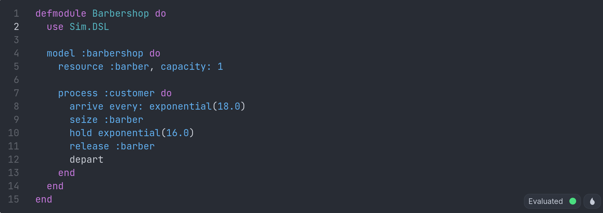

# sim_ex

Discrete-event simulation engine for the BEAM.

Lightweight processes as entities, ETS-based shared topology,
barrier synchronization, streaming Welford statistics. Zero runtime dependencies.





## Quick Start

```elixir
# M/M/1 queue: Poisson arrivals, exponential service
{:ok, result} = Sim.run(
  entities: [
    {:arrivals, Sim.Source, %{id: :arrivals, target: :server,
      interarrival: {:exponential, 1.0}, seed: 42}},
    {:server, Sim.Resource, %{id: :server, capacity: 1,
      service: {:exponential, 0.5}, seed: 99}}
  ],
  initial_events: [{0.0, :arrivals, :generate}],
  stop_time: 10_000.0
)

result.stats[:server]
# %{arrivals: 10042, departures: 10041, mean_wait: 0.49, ...}
```

## Architecture

```
Sim.Clock ──── advances virtual time event-by-event
    │
Sim.Calendar ─ priority queue (:gb_trees, FIFO tie-breaking)
    │
Sim.EntityManager ─ registry + dispatch
    │
    ├── Sim.Entity ─── @behaviour: init/1, handle_event/3, statistics/1
    ├── Sim.Resource ── capacity-limited server with FIFO queue
    ├── Sim.Source ──── arrival generator (exponential, constant)
    └── Sim.PHOLD ──── standard DES benchmark entity

Sim.Topology ──── ETS shared state (networks, occupancy, routing)
Sim.Statistics ── Welford streaming mean/variance + batch means CI
Sim.Experiment ── replications, CRN, paired comparison
```

### Design Principles

1. **Process = entity** (InterSCSimulator pattern). Inline mode for speed, process mode for scale.
2. **ETS for topology** — shared reads are free, writes are rare. No actor-per-link bottleneck.
3. **Barrier synchronization** — all entities complete current event before clock advances. Simple, correct.
4. **Functional PRNG** — `:rand` state threaded through entities. Same seed = same trajectory. CRN for free.
5. **Zero runtime dependencies** — pure Elixir + OTP for core engines. Rust toolchain for NIF engine. Optional integration with Les Quatre Probabileurs.

## DSL for Subject Matter Experts

GPSS/Arena-inspired syntax that compiles to Entity modules:

```elixir
defmodule Barbershop do
  use Sim.DSL

  model :barbershop do
    resource :barber, capacity: 1

    process :customer do
      arrive every: exponential(18.0)
      seize :barber
      hold exponential(16.0)
      release :barber
      depart
    end
  end
end

Barbershop.run(stop_time: 10_000.0, seed: 42)
```

No magic runtime. `mix compile` generates standard `Sim.Entity` modules.
Works in engine, ETS, tick-diasca, parallel, and Rust modes.

### DSL Verbs — 14 Arena-Style Verbs

| Verb | Arena Equivalent | Description |
|------|-----------------|-------------|
| `arrive every:` | CREATE | Stationary interarrival |
| `arrive schedule:` | CREATE (schedule) | Non-stationary (time-varying rate) |
| `seize :resource` | SEIZE | Request capacity, block if busy |
| `hold distribution` | DELAY | Consume time |
| `release :resource` | RELEASE | Free capacity |
| `route distribution` | ROUTE | Travel delay (no resource) |
| `decide prob, :label` | DECIDE | Binary probabilistic branch |
| `decide [{p, :l}, ...]` | DECIDE | Multi-way weighted routing |
| `batch N` | BATCH | Accumulate N parts |
| `split N` | SEPARATE | One part becomes N |
| `combine N` | COMBINE / MATCH | N parts merge into one |
| `assign :key, value` | ASSIGN | Set attribute on entity instance |
| `transport :conveyor` | CONVEY | Capacity-limited travel delay |
| `label :name` | STATION | Jump target for decide |
| `depart` | DISPOSE | Exit, collect statistics |
| `resource :r, capacity: N` | RESOURCE | Fixed capacity |
| `resource :r, preemptive: true` | PREEMPT | Priority-based ejection |
| `resource :r, schedule: [...]` | SCHEDULE | Time-varying capacity by shift |
| `conveyor :c, length:, speed:` | CONVEYOR | Physical transport with capacity |

### Advanced Example — Electronics Manufacturing

```elixir
defmodule Electronics do
  use Sim.DSL

  model :electronics do
    resource :solder, capacity: 8
    resource :inspector, schedule: [{0..479, 3}, {480..959, 1}]
    resource :rework, capacity: 1

    process :pcb do
      arrive schedule: [{0..479, {:exponential, 3.0}},
                        {480..959, {:exponential, 6.0}}]
      split 4                          # PCB → 4 panels
      seize :solder
      hold exponential(3.0)
      release :solder
      decide 0.05, :rework_panel       # 5% fail inspection
      combine 4                         # 4 panels → 1 board
      batch 10                          # 10 boards → 1 tray
      depart
      label :rework_panel
      seize :rework
      hold exponential(6.0)
      release :rework
      depart
    end
  end
end
```

## Tick-Diasca Engine

Causal ordering via two-level timestamps (Sim-Diasca pattern). Entity at
`(T, D)` produces events stamped `(T, D+1)`. Tick advances only when no
more diascas are pending (quiescence).

```elixir
# Entities return tagged events:
{:same_tick, target, payload}    # → (T, D+1)
{:tick, future_tick, target, payload}  # → (future_tick, 0)
{:delay, delta, target, payload}       # → (T + delta, 0)
```

```elixir
Sim.run(
  mode: :diasca,
  entities: [...],
  initial_events: [{0, :source, :generate}],
  stop_tick: 10_000
)
```

## Benchmarks

88-core Xeon E5-2699 v4, OTP 27, Elixir 1.18.3.

### Elixir Engine (PHOLD)

| LPs | Events | Engine E/s | GenServer E/s | Speedup |
|-----|--------|-----------|--------------|---------|
| 100 | 162K | 270K | 70K | 3.8x |
| 1,000 | 1.6M | 146K | 63K | 2.3x |
| 10,000 | 1.8M | 88K | 40K | 2.2x |

### Rust NIF Engine (barbershop)

| Stop tick | Events | Events/sec |
|-----------|--------|-----------|
| 50K | 81K | 3.1M |
| 500K | 804K | 6.4M |

### DSL Complex (12 verbs, all composing)

| Model | Events/sec | Verbs used |
|-------|-----------|------------|
| Barbershop | 687K | 5 (seize, hold, release, arrive, depart) |
| Job Shop | 761K | 8 (+ route, schedule) |
| Rework Line | 911K | + decide, label |
| Electronics | 739K | + split(4), combine(4), batch(10) |
| Full Fab | 671K | 12 verbs, 8 resources |

Complexity tax: 1.6x between simplest and most complex.

### sim_ex vs SimPy

Single run (per-rep):

| Model | SimPy | sim_ex Elixir | sim_ex Rust |
|-------|-------|--------------|-------------|
| Barbershop 200K | 127ms | 55ms (**2.3x**) | 15ms (**8.5x**) |
| Job Shop 200K | 2,479ms | 1,200ms (**2.1x**) | — |
| Rework 200K | 601ms | 225ms (**2.7x**) | — |

Batch replications (1,000 reps x 200K — the analysis that matters):

| Configuration | Wall time | Per-rep | vs SimPy |
|---------------|-----------|---------|----------|
| SimPy (sequential) | ~6,300ms | 6.3ms | 1.0x |
| Elixir parallel (88 cores) | 683ms | 0.7ms | **9.4x** |
| Rust NIF parallel (88 cores) | 207ms | 0.2ms | **30x** |

The BEAM's advantage is not per-event speed. It's per-replication concurrency.
`Sim.Experiment.replicate` is parallel by default.

```bash
# Run benchmarks yourself:
mix run benchmark/phold_bench.exs           # PHOLD sweep
mix run benchmark/engine_vs_genserver.exs   # Engine vs GenServer A/B
mix run benchmark/ets_ab.exs                # ETS vs Map A/B
mix run benchmark/full_bench.exs            # Comprehensive (15 min)
mix run benchmark/full_bench.exs -- quick   # Quick smoke (60s)
mix run benchmark/dsl_complexity_bench.exs  # DSL verb complexity impact
```


## Writing Entities

Implement the `Sim.Entity` behaviour:

```elixir
defmodule MyMachine do
  @behaviour Sim.Entity

  @impl true
  def init(config) do
    {:ok, %{id: config.id, processed: 0}}
  end

  @impl true
  def handle_event({:job, job_id}, clock, state) do
    # Process the job, schedule completion
    finish_time = clock + 5.0
    events = [{finish_time, :sink, {:done, job_id}}]
    {:ok, %{state | processed: state.processed + 1}, events}
  end

  @impl true
  def statistics(state), do: %{processed: state.processed}
end
```

## Experimental Design

```elixir
# 1,000 independent replications — parallel by default, all cores
results = Sim.Experiment.replicate(fn seed ->
  {:ok, r} = Sim.run(my_model(seed))
  r.stats[:server]
end, 1000)

# Compare two configurations with common random numbers
comparison = Sim.Experiment.compare(
  config_a: fn seed -> run_model(config_a, seed) end,
  config_b: fn seed -> run_model(config_b, seed) end,
  seeds: 1..30,
  metric: :mean_wait
)
# => %{mean_diff: -0.12, ci: {-0.18, -0.06}, significant: true}
```

## The Simulation That Learns

Every DES engine does Monte Carlo: run 1,000 times, sample inputs from
a fitted distribution, compute output confidence intervals. The input
parameters are treated as known constants. They are not.

sim_ex is the only DES engine where simulation inputs have proper Bayesian
posteriors, where the model self-calibrates from streaming data, and where
input structure is discovered nonparametrically.

| What others do | What sim_ex + ecosystem does |
|---|---|
| Service time = Exponential(16) | Service time = Exponential(16.2 +/- 1.3) — full posterior from 200 observations (eXMC) |
| Parameters frozen at model build | Parameters track drift in real time from sensor data (smc_ex O-SMC²) |
| Analyst picks which inputs matter | BART discovers which 5 of 50 inputs drive output (StochTree-Ex) |
| Output CI from replications only | Output CI includes epistemic uncertainty over input parameters |
| Simultaneous events: FIFO | Simultaneous events: causal ordering via tick-diasca |

Arena and AnyLogic have 30 years of domain libraries and 3D animation.
We don't replace them. We add the statistical brain they don't have.

## Les Quatre Probabileurs

sim_ex is part of an Elixir probabilistic computing ecosystem:

| Library | What | Role in Simulation |
|---------|------|-------------------|
| **sim_ex** | DES engine | The simulator itself |
| [eXMC](https://github.com/borodark/eXMC) | NUTS/HMC, ADVI, Pathfinder | Input modeling: posterior over distribution params |
| [smc_ex](https://github.com/borodark/smc_ex) | O-SMC², particle filters | Self-calibrating digital twins |
| [StochTree-Ex](https://github.com/borodark/stochtree_ex) | BART | Metamodeling: which inputs drive output |

```elixir
# Optional deps — sim_ex works standalone
def deps do
  [
    {:sim_ex, "~> 0.1"},
    {:exmc, "~> 0.2", optional: true},        # Bayesian input modeling
    {:smc_ex, "~> 0.1", optional: true},       # Online calibration
    {:stochtree_ex, "~> 0.1", optional: true}  # Sensitivity analysis
  ]
end
```

## The Book (in progress)

*The Factory That Learns: A Practitioner's Guide to Bayesian Inference
for Manufacturing* is being written around sim_ex and Les Quatre
Probabileurs. First draft complete. Not yet published — early
access planned for late 2026. Eight chapters, each an executable
Livebook notebook:

1. **Five Lines That Describe a Factory** — DSL, M/M/1 verification, a 200-machine packaging line
2. **The Number You Don't Know** — 1,000 replications in 68 seconds, the analysis Averill Law called "rarely done"
3. **The Chart That Thinks** — Bayesian SPC: 73% the process shifted, not "alarm"
4. **When Will This Machine Fail?** — hierarchical Weibull, 20 component types, censored data
5. **The Bearing Knows When It Will Die** — degradation curves on FEMTO run-to-failure data
6. **A Hundred Engines, One Model** — fleet RUL on NASA C-MAPSS, partial pooling across 100 turbofans
7. **The Simulation That Learns** — all four libraries connected, self-calibrating digital twin
8. **What to Do Monday Morning** — ten steps from "I read this book" to "my factory is learning"

The book is for manufacturing engineers, not Elixir developers.
`seize :drill / hold exponential(8.0) / release :drill` reads
like the routing sheet already taped to the machine. The posterior
is the part that's new. The factory floor is the part that's familiar.

## Installation

```elixir
def deps do
  [
    {:sim_ex, "~> 0.1.0"}
  ]
end
```

## License

Apache-2.0
